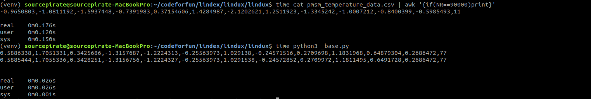

## Lindux

A lightweight and fast line indexer for very huge csv files.

## Usage

```python
from lindux import iread, index

# for indexing a csv file
index('verylarge.csv')

# reading n'th line in csv file 
# `num_lines` denote the number of lines to be read
iread('verylarge.csv', n=500000, num_lines=10)

```

## Benchmark



## License 
MIT


